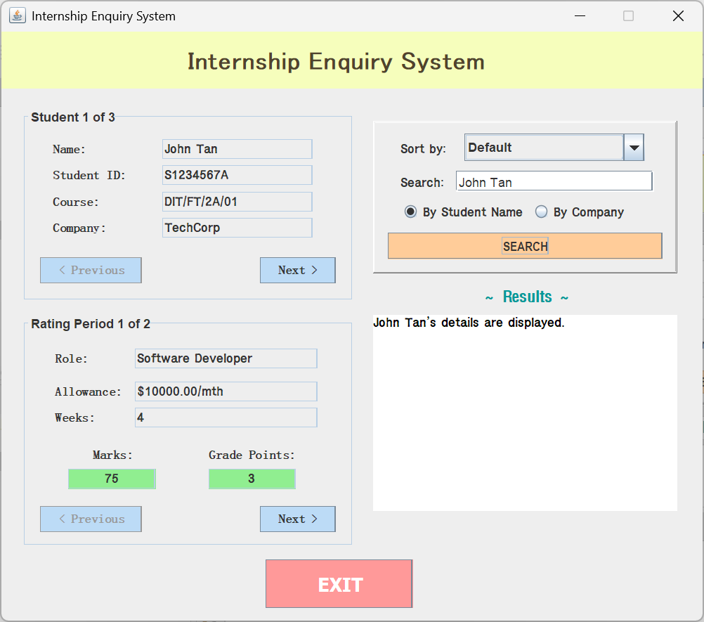
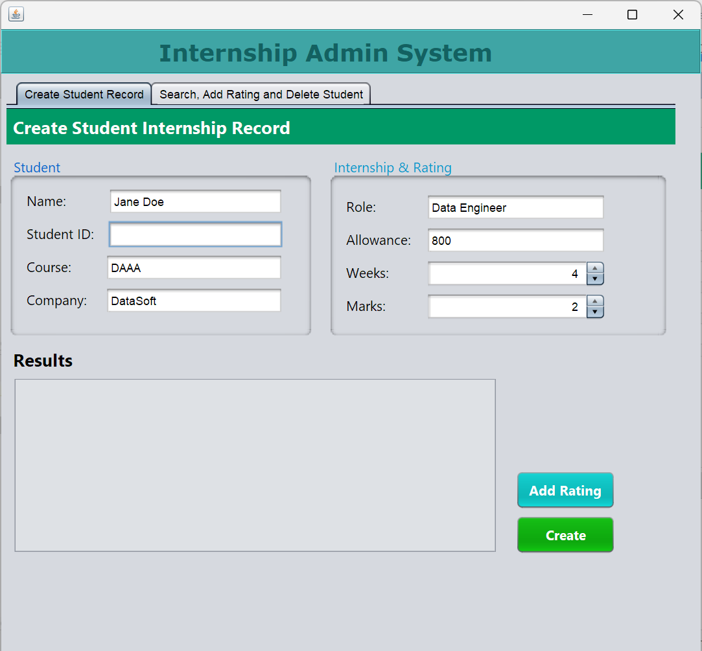

<div align="center">

# 🎓 Student Internship Management System

**A dual-interface Java Swing desktop application for managing student internship placements, company partners, and performance ratings.**

[](https://www.java.com/)
[](https://docs.oracle.com/javase/tutorial/uiswing/)
[](https://netbeans.apache.org/)


</div>

---

## 📖 Overview

This project models the workflow of a school's internship office. Students are placed with partner companies, supervisors submit performance ratings across multiple assessment periods, and staff need to browse, search, and maintain those records.

The system ships as **two separate GUI applications** sharing one object model and one data layer:

| Application | Audience | Purpose |
| :--- | :--- | :--- |
| 🔍 **Enquiry System** | Read-only users | Browse, search, and sort internship records |
| 🛠️ **Admin System** | Staff | Create, update, and delete student records |

Both are built with **Java Swing** using the NetBeans GUI Builder, and persist data through **plain text** and **Java object serialization**.

---

## ✨ Features

### 🔍 Internship Enquiry System

<table>
<tr><td width="30"><b>1</b></td><td><b>Browse all internships</b><br>Step through every student record with previous/next navigation, including a per-record rating period carousel. Navigation buttons disable automatically at the boundaries.</td></tr>
<tr><td><b>2</b></td><td><b>Search by student name</b><br>Filter records to a matching student and jump straight to their details.</td></tr>
<tr><td><b>3</b></td><td><b>Search by company name</b><br>Pull up every student placed at a given company.</td></tr>
<tr><td><b>4</b></td><td><b>Sort records</b><br>Reorder by <code>Student ID (asc/desc)</code> or <code>Course (A–Z / Z–A)</code>, with a <code>Default</code> option that reloads the original file order.</td></tr>
</table>

> 🎨 **Colour-coded performance** — grade points are highlighted green (3+), yellow (2), or red (below 2) so weak assessment periods stand out immediately.

### 🛠️ Internship Admin System

<table>
<tr><td width="30"><b>1</b></td><td><b>Create student record</b><br>Register a new student against an existing company, with validation for duplicate student IDs, unknown company names, and negative allowances.</td></tr>
<tr><td><b>2</b></td><td><b>Search student</b><br>Look up an existing record by student ID or name via radio-button mode selection, with inline red error text when nothing matches.</td></tr>
<tr><td><b>3</b></td><td><b>Add performance rating</b><br>Append a new rating period (weeks assessed + marks) to the loaded student. Weeks must be positive and marks must fall within 0–100.</td></tr>
<tr><td><b>4</b></td><td><b>Delete student</b><br>Remove a record after a confirmation dialog, rebuilding the student array without the deleted entry.</td></tr>
<tr><td><b>5</b></td><td><b>Exit and save</b><br>Prompts to write changes back to the text file, then always writes a serialized snapshot before closing.</td></tr>
</table>

---

## 🏗️ Architecture

```
┌─────────────────────────┐   ┌─────────────────────────┐
│  InternshipEnquiryGUI   │   │  InternshipAdminGUI     │
│  (browse / search)      │   │  (create / edit / del)  │
└───────────┬─────────────┘   └───────────┬─────────────┘
            │                             │
            └──────────────┬──────────────┘
                           ▼
                   ┌───────────────┐
                   │  FileHandler  │  ← load / save
                   └───────┬───────┘
                           ▼
              ┌────────────┴────────────┐
              ▼                         ▼
      ┌───────────────┐         ┌───────────────┐
      │    Student    │────────▶│    Company    │
      └───────────────┘  has-a  └───────────────┘
                           │
              ┌────────────┴────────────┐
              ▼                         ▼
      internships.txt              data.dat
      (human-readable)             (serialized)
```

### 📁 Project structure

```
src/assignment2/
├── Company.java                        # Company model (Serializable)
├── Student.java                        # Student model, ratings & grade points
├── FileHandler.java                    # Text + serialized I/O layer
├── InternshipEnquirySystemGUI.java     # Read-only browsing interface
├── InternshipEnquirySystemGUI.form     # NetBeans form definition
├── InternshipAdminSystemGUI.java       # Record management interface
├── InternshipAdminSystemGUI.form       # NetBeans form definition
├── internships.txt                     # Seed data (text)
└── data.dat                            # Serialized snapshot
```

---

## 💾 Data format

`internships.txt` is a two-section, semicolon-delimited file.

**Section 1 — Companies**

```
<number of companies>
Company Name;Contact Person;Monthly Allowance
```

**Section 2 — Students**

```
<number of students>
Course;Student ID;Name;Company;Role;<n rating periods>;Weeks;Marks;Weeks;Marks;...
```

**Example**

```
3
TechCorp;Alice Tan;10000.0
DataWave;Bob Lim;2200.0
CloudSoft;Carol Ng;2800.0
3
DIT/FT/2A/01;S1234567A;John Tan;TechCorp;Software Developer;2;4;75;4;66
DAAA/FT/2B/02;S2345678B;Mary Goh;DataWave;Data Analyst;3;4;80;4;72;6;90
DIT/FT/2A/03;S3456789C;Jack Lim;CloudSoft;Cloud Engineer;2;6;55;4;68
```

Each student's rating block is variable-length — the count field tells the parser how many `weeks;marks` pairs follow. On load, every student is linked to its `Company` object by name, so allowance changes propagate to all students at that company.

---

## 🚀 Getting started

### Prerequisites


### Run it

```bash
# 1. Clone
git clone https://github.com/<your-username>/<your-repo>.git

# 2. Open the project in NetBeans (File → Open Project)
#    The .form files require the NetBeans GUI Builder to edit.

# 3. Run either entry point:
#    - InternshipEnquirySystemGUI.java   → browsing interface
#    - InternshipAdminSystemGUI.java     → admin interface
```

On startup the Admin System asks whether to load from the **text file** or the **serialized file**, so you can choose between the clean seed data and your last saved session.

---

## 🧠 Concepts demonstrated

<div align="center">

| Area | Applied in this project |
| :--- | :--- |
| **Encapsulation** | Private fields with getters/setters across `Student` and `Company` |
| **Object composition** | `Student` holds a reference to its assigned `Company` |
| **Arrays of objects** | Fixed-size arrays resized manually on create/delete |
| **File I/O** | `BufferedReader` / `PrintWriter` for delimited text parsing |
| **Serialization** | `ObjectInputStream` / `ObjectOutputStream` for binary snapshots |
| **Exception handling** | Guarded parsing, validation errors surfaced to the UI |
| **Event-driven GUI** | Swing listeners, tabbed panes, dialogs, radio groups |
| **Sorting algorithms** | Hand-written bubble sort over multiple comparison keys |

</div>

---

## 📸 Screenshots

| Enquiry System | Admin System |
| :---: | :---: |
|  |  |

---

## 📄 License

Released under the MIT License. See [`LICENSE`](LICENSE) for details.

---

<div align="center">

**Built as a Java OOP coursework project.**

⭐ Star this repo if you found it useful!

</div>
